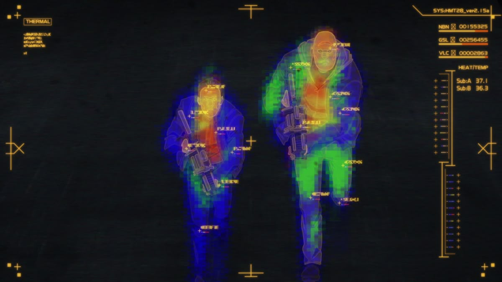

# Pathogen

City-scale pandemic strategy game built with React, TypeScript, MapLibre, and deck.gl.



## Overview

Pathogen is a browser game set in NYC where you play one of two opposing roles:

- **Pathogen Architect**: evolve spread, symptoms, and abilities to overwhelm the city.
- **City Response Controller**: manage policy, hospitals, and operations to contain the outbreak.

The game includes:

- Two asymmetric modes with shared simulation systems.
- Story and free-play starts with setup customization.
- Borough-level map simulation and visual overlays.
- Upgrade systems, emergency actions, milestones, and event logs.
- Local save/load with resume-on-refresh support.
- Optional AI Evolution Director (OpenRouter-backed) for adaptive virus behavior.

## Tech Stack

- **Frontend**: React 18 + TypeScript + Vite
- **Map/Rendering**: MapLibre GL + deck.gl
- **State**: Zustand
- **Server**: Express (dev + preview host, AI proxy endpoint)
- **Testing**: Vitest + Testing Library

## Quick Start

### 1. Prerequisites

- Node.js **20+**
- `pnpm` (recommended) or `npm`

### 2. Install dependencies

```bash
pnpm install
```

### 3. Run locally

```bash
pnpm dev
```

Open [http://localhost:5173](http://localhost:5173).

## Environment Variables

Create a `.env.local` in the repo root for optional integrations:

```bash
# Optional: enables AI Evolution Director requests via /api/ai-director
OPENROUTER_API_KEY=your_key_here
OPENROUTER_MODEL=arcee-ai/trinity-mini:free
OPENROUTER_HTTP_REFERER=http://localhost:5173
OPENROUTER_APP_TITLE=Pathogen Webgame

# Optional: custom map style
VITE_MAPTILER_KEY=your_maptiler_key
VITE_MAP_STYLE=dataviz-dark

# Optional: dev server port (defaults to 5173)
PORT=5173
```

Notes:

- Without `OPENROUTER_API_KEY`, the game still runs; AI director calls return `503`.
- Without `VITE_MAPTILER_KEY`, the map falls back to OpenStreetMap raster tiles.

## Scripts

- `pnpm dev`: run the Express + Vite middleware dev server.
- `pnpm build`: create production assets in `dist/`.
- `pnpm preview`: serve production build with the same Express server.
- `pnpm test`: run Vitest (watch mode by default).
- `pnpm check`: TypeScript type-check (`tsc --noEmit`).

Single-run tests:

```bash
pnpm test -- --run
```

## Project Structure

```text
.
├── src/
│   ├── assets/        # static game assets + NYC data
│   ├── audio/         # SFX/BGM logic
│   ├── events/        # world/nexus/consequence event definitions
│   ├── map/           # MapLibre + deck.gl map rendering
│   ├── sim/           # simulation systems and scoring
│   ├── state/         # Zustand stores, actions, selectors, types
│   ├── story/         # story campaign definitions
│   └── ui/            # HUD, screens, components, UI systems
├── server/            # Express server + OpenRouter proxy
├── tasks/             # planning/notes docs
└── pandemic-webgame-frontend-spec.md
```

## Development Notes

- The app is a single-page flow: boot -> title -> setup -> game -> game over.
- `server/index.js` handles both Vite middleware (dev) and static serving (preview/prod).
- All game progression persists locally via save/load actions and scene restoration.
- AI director integration is intentionally optional and routed through `POST /api/ai-director`.

## Troubleshooting

- **Port already in use**: run with another port, e.g. `PORT=5174 pnpm dev`.
- **Blank/failed map style**: verify `VITE_MAPTILER_KEY` and `VITE_MAP_STYLE`, or unset both to use raster fallback.
- **AI requests failing**: confirm `OPENROUTER_API_KEY` in `.env.local` and restart dev server.

